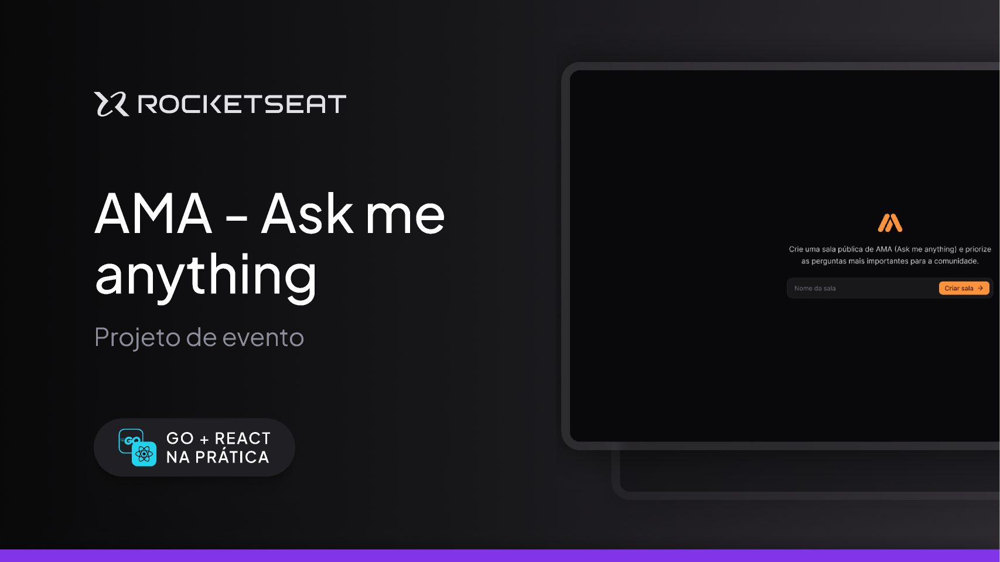

# Tech-Go-React 🗺️🛩️

**AMA - Ask Me Anything** é uma aplicação Q&A com Websocket, você pode:

- Criar sua sala de perguntas
- Compartilhar o link usando funcionalidades nativas do browser se disponível, senão, copiará o link da aplicação
- Enviar perguntas, curtir comentários e marcar perguntas como respondida, tudo isso ao vivo

## 📝 Funcionalidades e Desafios

Neste projeto, me desafiei implementando:

- **React19**: Configurando a versão candidate para habilitar funcionalidades Action nativa do browser.
- **Tanstack React Query**: Utilização do Hook para checar atualizações as requisições e respostas da aplicação.
- **Sonner**: Utilização da lib Sonner para retorno das requisições e user friendly.
- **HTTP**: Requisições HTTPs para comunicação onTime com o backend utilizando métodos de carregamento dinâmicos.

## 👨‍💻 Autor

[Gustavo Teixeira](https://github.com/taylosstls)  
[LinkedIn](https://www.linkedin.com/in/gustavoteixeiralgnt/)  
[Instagram](https://www.instagram.com/gustavo.lgnt/)